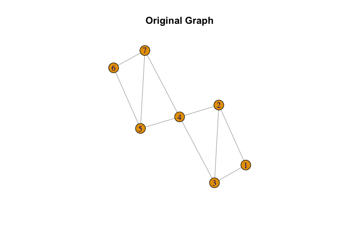
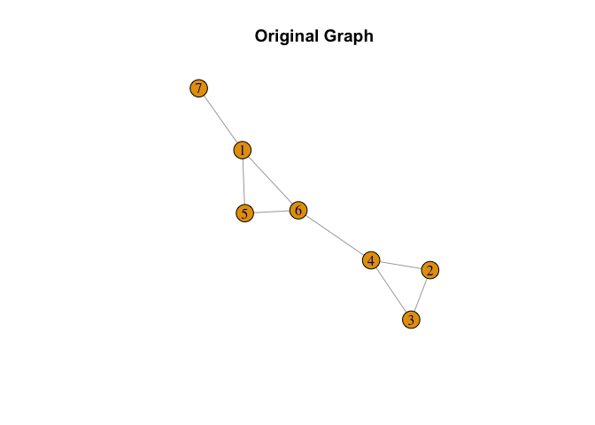
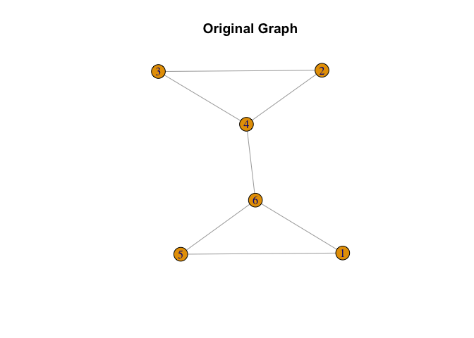

Graph Theory Clustering Algorithm
================
Klopfer Huang
2024-07-07

Read the distance matrix from an Excel file and drop the first column to
ensure the dataset is a symmetric matrix. Then, define the number of
rows in the matrix.

``` r
library(igraph)
```

    ## 
    ## Attaching package: 'igraph'

    ## The following objects are masked from 'package:stats':
    ## 
    ##     decompose, spectrum

    ## The following object is masked from 'package:base':
    ## 
    ##     union

``` r
library(readxl)
dist_matrix <- read_excel("/Users/klopfer/Downloads/Transfer/Cities Distance Matrix.xlsx", sheet = 2)
```

    ## New names:
    ## • `` -> `...1`

``` r
# Drop the first column to make the dataset as symmetric matrix
dist_matrix <- dist_matrix[-c(1)]
n = nrow(dist_matrix)
```

Define a function ‘shared_nodes’ to find the common nodes between two
cliques.

``` r
shared_nodes <- function(clique1, clique2) {
  intersect(clique1, clique2)
}
```

Define a function ‘find_largest_clique’ to find the largest clique in
the graph. If there are multiple largest cliques, it selects the one
with the most shared nodes and the smallest average distance between
shared and unshared nodes.

``` r
# Function to find the largest clique
find_largest_clique <- function(graph, edge_mat,distance_matrix) {
  largest_cliques <- largest_cliques(graph)
  # Determine whether there are ties
  if (length(largest_cliques) > 1) {
    # Determine whether there are shared nodes
    max_shared_nodes <- 0
    max_shared_nodes_info <- list()
# Find all largest shared nodes sequence with their clique pairs
    for (i in 1:(length(largest_cliques) - 1)) {
      for (j in (i + 1):length(largest_cliques)) {
        shared <- shared_nodes(largest_cliques[[i]], largest_cliques[[j]])
        if (length(shared) > max_shared_nodes) {
          max_shared_nodes <- length(shared)
          max_shared_nodes_info <- list(list(clique1 = largest_cliques[[i]], 
                                             clique2 = largest_cliques[[j]], 
                                             shared_nodes = shared))
        } else if (length(shared) == max_shared_nodes) {
          max_shared_nodes_info <- append(max_shared_nodes_info, 
                                          list(list(clique1 = largest_cliques[[i]], 
                                                    clique2 = largest_cliques[[j]], 
                                                    shared_nodes = shared)))
        }
      }
    }
    if (max_shared_nodes >0){
    # Create a list to store the shared nodes from different pairs of cliques
    shared_nodes_vectors <- list()
    
    # Iterate through the max_shared_nodes_info list and store the shared nodes in separate vectors
    for (info in max_shared_nodes_info) {
      shared_nodes_vectors <- append(shared_nodes_vectors, list(info$shared_nodes))
    }
    # Define a function to convert a vector to a single string
    vector_to_string <- function(vec) {
      paste0(vec, collapse = "|")
    }
    
    # Convert each vector element in the list to a single string
    string_list <- lapply(shared_nodes_vectors, vector_to_string)
    
    # Find the indices of unique elements in the string list
    unique_indices <- !duplicated(string_list)
    
    # Filter the original list using the unique_indices
    unique_list <- shared_nodes_vectors[unique_indices]
    # Find the index of the clique with the shortest average distance between the shared nodes and unshared_nodes
    avg_dists <- list()
    j = 0
    for (i in 1:length(largest_cliques)) {
      unshared_nodes <- setdiff(largest_cliques[[i]], unique_list[[1]])
      if (length(unshared_nodes) != length(largest_cliques[[i]])) {
        j = j +1
        dists <- distance_matrix[as.vector(unique_list[[1]]), unshared_nodes]
        avg_dists[[j]] <- list(index = i,distance = mean(dists))
      }
    }
    # Extract the distances from the nested lists using sapply()
    distances <- sapply(avg_dists, function(x) x$distance)
    
    # Find the index of the smallest distance
    min_index <- which.min(distances)
    
    # Get the corresponding index value from dists
    index_with_min_distance <- avg_dists[[min_index]]$index
    
    chosen_clique <- largest_cliques[index_with_min_distance]
    } else {
      chosen_clique <- largest_cliques[1]
    }
  } else {
    chosen_clique <- largest_cliques[1]
  }
  
  return(chosen_clique)
}
```

Define the main function ‘clustering_algorithm’ to perform the
clustering algorithm. This function creates an edge matrix based on the
‘theta’ value, constructs a graph, and iteratively finds the largest
cliques using the find_largest_clique function, adding them to a data
frame and removing them from the graph until no nodes are left.

``` r
# Main function
clustering_algorithm <- function(distance_matrix, theta) {
  n <- nrow(distance_matrix)
  
  # Create an edge matrix based on the theta value
  edge_mat <- ifelse(distance_matrix < theta, 1, 0)
  diag(edge_mat) <- 0
  
  # Create a graph from the edge matrix
  graph <- graph_from_adjacency_matrix(edge_mat, mode = "undirected", weighted = TRUE)
  node_labels <- 1:n
  V(graph)$name <- node_labels
  edge_mat <- get.adjacency(graph)
  edge_mat <- as.matrix(edge_mat)
  # Initialize the data frame to store cliques
  cliques_df <- data.frame()
  
  while (TRUE) {
    # Find the largest clique in the graph
    largest_clique <- find_largest_clique(graph, edge_mat,distance_matrix)
    # Add the largest clique to the data frame
    cliques_df <- rbind(cliques_df, 
                        list(paste(V(graph)[largest_clique[[1]]]$name, collapse = ",")))
    
    # Remove connections between the largest clique and the rest of the graph
    graph <- delete_vertices(graph, largest_clique[[1]])
    edge_mat <- get.adjacency(graph)
    edge_mat <- as.matrix(edge_mat)
    if (nrow(edge_mat) == 0) {
      break
    }}
  
  # Return the data frame of cliques
  return(cliques_df)
}
```

Create sample distance matrices, define ‘theta’ values, and use the
‘clustering_algorithm’ function to perform clustering. Plot the original
graph and print the clustering results.

``` r
distance_matrix <- matrix(c(0, 2, 2, 9, 9, 9, 9,
                            2, 0, 4, 3, 9, 9, 9,
                            2, 4, 0, 3, 9, 9, 9,
                            9, 3, 3, 0, 2, 9, 2,
                            9, 9, 9, 2, 0, 3, 4,
                            9, 9, 9, 9, 3, 0, 6,
                            9, 9, 9, 2, 4, 6, 0),
                          nrow = 7, ncol = 7)

theta <- 9
edge_mat <- ifelse(distance_matrix < theta, 1, 0)
diag(edge_mat) <- 0
graph <- graph_from_adjacency_matrix(edge_mat, mode = "undirected", weighted = TRUE)
result <- clustering_algorithm(distance_matrix, theta)
plot(graph, main = "Original Graph")
```

<!-- -->

``` r
print(result)
```

    ##   X.4.7.5.
    ## 1    4,7,5
    ## 2    1,2,3
    ## 3        6

There are 4 cliques with length 3. The algorithm put cliques with 57 and
23 with higher priority, because nodes 75 and nodes 23 are shared by two
cliques(567,457 and 123, 234) respectively. Note that clique 457 and 234
have a common node 4, so it is important to decide which one of them is
the cluster we want(because once 4 appears in one cluster it cannot
appear in others). The principle we apply here is the following: For 5,7
we compare node 6 in 567 and node 4 in 457 which one has smaller average
distance to 5 and 7, at the meantime, we compare the distance between
node 1 in 123 and node 4 in 234 which one has smaller average distance
to 2 and 3. In this case avg_dist(4,57)=3 \> avg_dist(6,57)=2, and
avg_dist(4,23)=2 \< avg_dist(1,23)=4.5. So those with avg_dist = 2 are
the two clusters we want. Note that we still need to compare
avg_dist(6,57) and avg_dist(4,23) in general, in this case, we do not
have avg_dist(6,57)=avg_dist(4,23). Otherwise, the algorithm probably
cannot choose the unique first cluster; however, in reality, it is
rarely to have avg_dist(6,57)=avg_dist(4,23).

``` r
distance_matrix <- matrix(c(0, 10, 6, 10, 10, 10,
                            10, 0, 6, 10, 10, 10,
                            6, 6, 0, 5, 10, 10,
                            10, 10, 5, 0, 4, 3,
                            10, 10, 10, 4, 0, 10,
                            10, 10, 10, 3, 10, 0),
                          nrow = 6, ncol = 6)

theta <- 10
edge_mat <- ifelse(distance_matrix < theta, 1, 0)
diag(edge_mat) <- 0
graph <- graph_from_adjacency_matrix(edge_mat, mode = "undirected", weighted = TRUE)
result <- clustering_algorithm(distance_matrix, theta)
plot(graph, main = "Original Graph")
```

<!-- -->

``` r
print(result)
```

    ##   X.3.4.
    ## 1    3,4
    ## 2      1
    ## 3      2
    ## 4      5
    ## 5      6

All cliques are with length 2, I set dist(3,4)=3, which is the smallest,
and all other nodes become singleton clusters.

``` r
distance_matrix <- matrix(c(0, 5, 5, 5, 1, 2, 4,
                            5, 0, 2, 3, 5, 5, 5,
                            5, 2, 0, 1, 5, 5, 5,
                            5, 3, 1, 0, 5, 0.5, 5,
                            1, 5, 5, 5, 0, 1, 5,
                            2, 5, 5, 0.5, 1, 0, 5,
                            4, 5, 5, 5, 5, 5, 0),
                          nrow = 7, ncol = 7)

theta <- 5
result <- clustering_algorithm(distance_matrix, theta)
edge_mat <- ifelse(distance_matrix < theta, 1, 0)
diag(edge_mat) <- 0
graph <- graph_from_adjacency_matrix(edge_mat, mode = "undirected", weighted = TRUE)
plot(graph, main = "Original Graph")
```

<!-- -->

``` r
print(result)
```

    ##   X.2.3.4.
    ## 1    2,3,4
    ## 2    1,5,6
    ## 3        7

This example can be used to show the principle of “cliques with more
nodes enjoy higher priority”, we can set the distance between 4 and 6 to
be very small(0.5 in this case), but still they cannot be in the same
cluster.

``` r
distance_matrix <- matrix(c(0, 5, 5, 5, 1, 2,
                            5, 0, 2, 3, 5, 5,
                            5, 2, 0, 1, 5, 5,
                            5, 3, 1, 0, 5, 3,
                            1, 5, 5, 5, 0, 1,
                            2, 5, 5, 3, 1, 0),
                          nrow = 6, ncol = 6)

theta <- 5
edge_mat <- ifelse(distance_matrix < theta, 1, 0)
diag(edge_mat) <- 0
graph <- graph_from_adjacency_matrix(edge_mat, mode = "undirected", weighted = TRUE)
result <- clustering_algorithm(distance_matrix, theta)
plot(graph, main = "Original Graph")
```

<!-- -->

``` r
print(result)
```

    ##   X.1.5.6.
    ## 1    1,5,6
    ## 2    2,3,4

Read the city names from the distance matrix and assign unique identity
numbers to each city. Create a data frame with city names and identity
numbers, then read a city-province mapping file and merge it with the
city data to include province information.

``` r
library(readxl)
city <-colnames(dist_matrix)
# Assign unique identity numbers to each city
identity_numbers <- seq_along(city)

# Create a dataframe with the city names and identity numbers
city_data <- data.frame(City = city, Identity = identity_numbers)

# Create a sample city-province mapping dataframe
city_province <- read_excel("/Users/klopfer/Downloads/Transfer/province.xlsx")

# Join the city_data dataframe with the city-province mapping dataframe
city_data_with_province <- merge(city_data, city_province, by = "City")

# Print the city data with province information
city_data_with_province <- city_data_with_province[order(city_data_with_province$Identity),]
```

Loop through each province, extract the cities belonging to the current
province, and create a distance matrix for each province. Store each
province’s distance matrix in a list.

``` r
province_matrices <- list()
# Loop through each province
for (province_id in unique(city_data_with_province$`Province Id`)) {
  
  # Get the cities belonging to the current province
  province_cities <- city_data_with_province[city_data_with_province$`Province Id` == province_id, "Identity"]
  
  # Extract the relevant rows and columns from the distance matrix
  province_distance_matrix <- dist_matrix[province_cities, province_cities]
  
  # Save the province distance matrix to the list
  province_matrices[[as.character(province_id)]] <- province_distance_matrix
}
```

Define a function ‘run_clustering_for_theta’ to perform clustering for
each province with a given ‘theta’ value. The function returns a list of
clustering results for each province.

``` r
# Function to run clustering for each province and theta value
run_clustering_for_theta <- function(theta) {
  province_clusters <- list()
  
  for (province_id in unique(city_data_with_province$`Province Id`)) {
    distance_matrix <- province_matrices[[as.character(province_id)]]
    distance_matrix <- as.matrix(distance_matrix)
    colnames(distance_matrix) <- NULL
    rownames(distance_matrix) <- NULL
    clusters <- clustering_algorithm(distance_matrix, theta)
    province_clusters[[as.character(province_id)]] <- clusters
  }
  
  return(province_clusters)
}
```

Perform clustering for each province with a specific ‘theta’ value (100
in this case). Replace the numerical identifiers with city names and
store the final results in a list. Display the clustering result for
Sichuan Province as an example.

``` r
# Initialize a list to store the final results
province_clusters <- list()
theta = 100
# Loop through each province
for (province_id in unique(city_data_with_province$`Province Id`)) {
  # Get the distance matrix
  distance_matrix <- province_matrices[[as.character(province_id)]]
  distance_matrix <- as.matrix(distance_matrix)
  colnames(distance_matrix) <- NULL
  rownames(distance_matrix) <- NULL

  # Apply the clustering_algorithm
  clusters <- clustering_algorithm(distance_matrix, theta)

  # Replace the numbers with city names
  province_cities <- city_data_with_province[city_data_with_province$`Province Id` == province_id, "Identity"]
  city_names <- city_data_with_province[city_data_with_province$`Province Id` == province_id, "City"]
  names(city_names) <- province_cities

  clusters_with_city_names <- clusters
  for (i in 1:nrow(clusters)) {
    cluster_numbers <- unlist(strsplit(as.character(clusters[i, 1]), ","))
    cluster_city_names <- city_names[as.numeric(cluster_numbers)]
    clusters_with_city_names[i, 1] <- paste(cluster_city_names, collapse = ",")
  }

  # Save the final result to the list
  province_clusters[[as.character(province_id)]] <- clusters_with_city_names
}
#Example:四川省 with theta = 100
province_clusters[["13"]]
```

    ##              X.3.12.20.
    ## 1  成都市,眉山市,资阳市
    ## 2         广安市,南充市
    ## 3         雅安市,乐山市
    ## 4         自贡市,宜宾市
    ## 5         内江市,泸州市
    ## 6         巴中市,达州市
    ## 7         德阳市,绵阳市
    ## 8    阿坝藏族羌族自治州
    ## 9        甘孜藏族自治州
    ## 10               广元市
    ## 11       凉山彝族自治州
    ## 12             攀枝花市
    ## 13               遂宁市

Calculate and store summary statistics for different ‘theta’ values.
Loop through each ‘theta’ value and perform clustering for each
province. Aggregate and pad the cluster length counts, then combine the
padded summary statistics for all ‘theta’ values into a single data
frame.

``` r
library(dplyr)
```

    ## 
    ## Attaching package: 'dplyr'

    ## The following objects are masked from 'package:igraph':
    ## 
    ##     as_data_frame, groups, union

    ## The following objects are masked from 'package:stats':
    ## 
    ##     filter, lag

    ## The following objects are masked from 'package:base':
    ## 
    ##     intersect, setdiff, setequal, union

``` r
# Initialize a list to store summary statistics for each theta value
theta_summary_stats <- list()

# Define theta values
theta_values <- c(50, 75, 100, 125, 150)

# Loop through each theta value
for (theta in theta_values) {
  province_clusters <- run_clustering_for_theta(theta)
  
  # Initialize a data frame to store cluster length counts
  cluster_length_counts <- data.frame()

  # Loop through each province's clusters
 for (province_id in names(province_clusters)) {
  clusters <- province_clusters[[province_id]]
  cluster_lengths <- sapply(strsplit(as.character(clusters[, 1]), ","), length)

  # Calculate cluster length counts for the current province
  province_cluster_length_counts <- as.data.frame(table(cluster_lengths))
  colnames(province_cluster_length_counts) <- c("Length", "Count")

  # Aggregate the cluster length counts across provinces
  if (nrow(cluster_length_counts) == 0) {
    cluster_length_counts <- province_cluster_length_counts
  } else {
    cluster_length_counts <- full_join(cluster_length_counts, province_cluster_length_counts, by = "Length")
    cluster_length_counts[is.na(cluster_length_counts)] <- 0
    cluster_length_counts$Count <- cluster_length_counts$Count.x + cluster_length_counts$Count.y
    cluster_length_counts <- cluster_length_counts[, c("Length", "Count")]
  }
}
  # Save the summary statistics for the current theta value
  theta_summary_stats[[as.character(theta)]] <- cluster_length_counts
}

# Convert the Length column to a numeric data type
theta_summary_stats <- lapply(theta_summary_stats, function(x) {
  x$Length <- as.numeric(as.character(x$Length))
  return(x)
})

# Find the maximum number of rows across all theta summary statistics
max_rows <- max(sapply(theta_summary_stats, nrow))

# Pad the data frames with zeros
theta_summary_stats_padded <- lapply(theta_summary_stats, function(x) {
  nrows_to_add <- max_rows - nrow(x)
  
  if (nrows_to_add > 0) {
    zero_rows <- data.frame(Length = (max(x$Length) + 1):(max(x$Length) + nrows_to_add),
                            Count = rep(0, nrows_to_add))
    x <- rbind(x, zero_rows)
  }
  
  return(x)
})

# Combine padded summary statistics for all theta values into a single data frame
summary_stats_df <- do.call(cbind, lapply(theta_summary_stats_padded, "[", "Count"))
colnames(summary_stats_df) <- as.character(theta_values)
rownames(summary_stats_df) <- theta_summary_stats_padded[[1]]$Length

# Reorder the rows in descending order based on row names
summary_stats_df <- summary_stats_df[order(as.numeric(rownames(summary_stats_df)), decreasing = TRUE), ]
```

Display the final summary statistics data frame containing the cluster
length counts for each ‘theta’ value.

``` r
summary_stats_df
```

    ##    50  75 100 125 150
    ## 6   0   0   0   1   1
    ## 5   0   2   2   2  10
    ## 4   0   1   2   4   3
    ## 3   5   3   8  15  11
    ## 2  16  22  38  28  21
    ## 1 150 131  79  64  55

This table as provided in Table A.4 in [Regional Poverty Alleviation
Partnership and E-Commerce
Trade](https://papers.ssrn.com/sol3/papers.cfm?abstract_id=4455034).
presents the distribution of segment size and the average within-cluster
distance for various threshold distances. The average within-cluster
distance is measured in kilometers (km) and is provided in parentheses.
